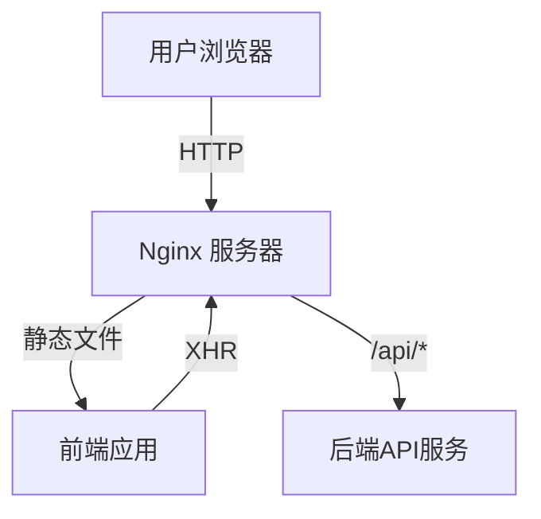

# WCL 分析系统部署文档

## 📋 部署概述

本文档描述了如何将 WCL 分析系统部署到生产环境的完整流程，包括前端构建、Nginx 配置和系统部署。

## 🏗️ 部署架构



## 📦 部署前准备

### 1. 系统要求
- 操作系统：Ubuntu 20.04+ / CentOS 8+
- Nginx：1.18+
- Node.js：16+
- 内存：至少 2GB
- 存储：至少 10GB 可用空间

### 2. 安装依赖
```bash
# 更新系统包
sudo apt update && sudo apt upgrade -y

# 安装 Node.js
curl -fsSL https://deb.nodesource.com/setup_18.x | sudo -E bash -
sudo apt-get install -y nodejs

# 安装 Nginx
sudo apt install -y nginx

# 验证安装
node --version
npm --version
nginx -v
```

## 🚀 完整部署流程

### 步骤 1: 构建前端应用
```bash
# 进入前端目录
cd frontend

# 安装依赖
npm install

# 构建生产版本
npm run build

# 构建完成后，检查 dist 目录
ls -la dist/
```

### 步骤 2: 运行部署脚本
```bash
# 回到项目根目录
cd ..

# 运行部署脚本
sudo ./deploy-nginx.sh
```

### 步骤 3: 验证部署
```bash
# 检查 Nginx 状态
sudo systemctl status nginx

# 测试配置文件
sudo nginx -t

# 访问应用
curl http://localhost

# 健康检查
curl http://localhost/health
```

## 📁 文件结构说明

部署完成后，文件将分布在以下位置：

```
/var/www/wcl-analyze/          # 前端静态文件
├── index.html                   # 主页面
├── assets/                      # 构建后的资源文件
├── images/                      # 图片资源
└── ...                         # 其他静态资源

/etc/nginx/sites-available/      # Nginx 配置
└── wcl-analyze                  # 站点配置

/var/log/nginx/                  # 日志文件
├── wcl-access.log               # 访问日志
└── wcl-error.log                # 错误日志
```

## ⚙️ Nginx 配置详解

### 主要配置项
- **监听端口**: 80
- **服务器名称**: localhost
- **根目录**: `/var/www/wcl-analyze`
- **默认页面**: `index.html`

### 代理配置
- **API 路径**: `/api/*`
- **后端地址**: `http://120.48.142.225:38080`
- **超时设置**: 60秒

### 性能优化
- **Gzip 压缩**: 启用，压缩文本内容
- **静态缓存**: JS/CSS/图片缓存 1 年
- **缓存控制**: 设置合理的缓存头

### 安全配置
- **X-Frame-Options**: 防止点击劫持
- **X-Content-Type-Options**: 防止 MIME 类型嗅探
- **X-XSS-Protection**: XSS 保护

## 🔍 监控与维护

### 查看日志
```bash
# 实时查看访问日志
tail -f /var/log/nginx/wcl-access.log

# 查看错误日志
tail -f /var/log/nginx/wcl-error.log

# 查看系统日志
journalctl -u nginx -f
```

### 性能监控
```bash
# 检查 Nginx 状态
sudo systemctl status nginx

# 查看连接数
ss -tuln | grep :80

# 检查配置文件语法
sudo nginx -t
```

### 重启服务
```bash
# 重载配置（推荐）
sudo systemctl reload nginx

# 重启服务
sudo systemctl restart nginx
```

## 🛠️ 故障排除

### 常见问题

#### 1. 权限问题
```bash
# 检查目录权限
ls -la /var/www/wcl-analyze/

# 修复权限
sudo chown -R www-data:www-data /var/www/wcl-analyze/
sudo chmod -R 755 /var/www/wcl-analyze/
```

#### 2. 端口冲突
```bash
# 检查端口占用
sudo netstat -tulnp | grep :80

# 查看进程
sudo lsof -i :80
```

#### 3. 配置错误
```bash
# 测试配置文件
sudo nginx -t

# 查看错误详情
sudo journalctl -u nginx --no-pager
```

### 调试步骤
1. 检查 Nginx 服务状态
2. 查看错误日志
3. 测试配置文件语法
4. 检查文件权限
5. 验证网络连接

## 🔐 安全建议

### 1. 防火墙配置
```bash
# 启用 UFW 防火墙
sudo ufw enable
sudo ufw allow 80/tcp
sudo ufw allow 443/tcp
```

### 2. SSL/TLS 配置（推荐）
```bash
# 安装 Certbot
sudo apt install certbot python3-certbot-nginx

# 获取 SSL 证书
sudo certbot --nginx -d your-domain.com
```

### 3. 定期更新
```bash
# 更新系统包
sudo apt update && sudo apt upgrade -y

# 更新 Nginx
sudo apt install --only-upgrade nginx
```

## 📞 技术支持

如果遇到问题，请提供以下信息：
1. 操作系统版本
2. Nginx 版本
3. 错误日志内容
4. 配置文件内容
5. 访问的URL和错误现象

## 📝 更新记录

| 日期 | 版本 | 变更内容 |
|------|------|----------|
| 2025-01-10 | 1.0 | 初始版本 |
| 2025-01-11 | 1.1 | 添加故障排除章节 |
| 2025-01-12 | 1.2 | 完善安全建议 |

---

**注意**: 部署前请确保已备份重要数据，并在测试环境验证部署流程。